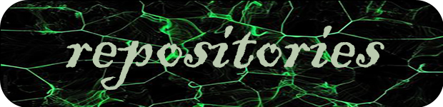

 
 
 

 

- Name **Amirhosein Gohari**

- Live in **IRAN, Tehran**

- Studying **Computer** And [**AI**](https://en.wikipedia.org/wiki/Artificial_intelligence)

- Good with **Python** 

 

 
 

[***Fastran***](https://github.com/amirhoseinG/FATSRAN-telegram-bot) is a wonderful translator on the telegram platform.
 
 
The [Enigma machine](https://github.com/amirhoseinG/Enigma-machine) is a cipher device developed .
 
 
 
 
 
 

